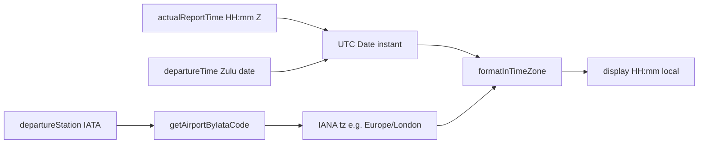

# Local report time (and future TZ offset) — documentation overview

## What we are adding

**Primary (this work):** When time mode is **Local**, show the crew **report clock** converted into the **departure airport’s** local time — not blank, and not raw Zulu.

**Secondary (on the radar, not in this change):** A way to show the **time difference between departure and arrival airports** (how many hours apart those two stations are for that sector’s dates). Parked for later; same building blocks (IATA → `tz`) will support it.

---

## Why

- Roster XML gives **report time as Zulu only** (`actualReportTime`, typically `HH:mm`). Departure/arrival already ship with local strings from the feed; report does not.
- In Local mode the pipe already shows green local dep/arr clocks, but report was intentionally blank (`(z - todo)` upstream + UI hide). Crews need **report in local at the station where they report**.
- Looking up `tz` from [`data/airport-codes.json`](../data/airport-codes.json) via existing [`getAirportByIataCode`](../db/airport-queries.ts) is the right source of truth (IANA zones, DST-aware) rather than inventing fixed offsets.

---

## How it works

1. Take the sector’s **departure station** IATA and resolve airport record → `tz`.
2. Build a **UTC instant**: Zulu calendar date from `departureTime` + `actualReportTime` as `HH:mm` (UTC).
3. Use **`date-fns` + `date-fns-tz`** (`formatInTimeZone`) to format that instant in the departure `tz`. Plain date-fns cannot convert IANA zones alone; we do **not** manually add/subtract a fixed hour offset (DST would break).
4. In **Zulu** mode: keep showing the raw report clock (drop the `(z - todo)` placeholder).
5. In **Local** mode: show the converted clock; if lookup/conversion fails, fall back to Zulu clock (or hide — implementation will prefer a safe visible fallback).

**Assumption:** report usually shares the same Zulu calendar day as `departureTime`. When the report clock is **later** than the departure clock (e.g. report `23:20`, dep `00:35`), we treat report as the **previous** UTC day — matching overnight turnarounds in the Maestro feed.

---

## What we are changing

| Area | Change |
|------|--------|
| Dependencies | Add `date-fns` and `date-fns-tz`. |
| [`components/useFlightTimeFormatter.ts`](../components/useFlightTimeFormatter.ts) | Accept `departureStation` (and existing times); compute `displayReportTime` as local `(l)` or zulu `(z)` from mode; remove `(z - todo)`. |
| Call sites / adapters | Ensure sector objects passed into `getFlightDisplayDetails` include `departureStation` + `departureTime` (already true for most roster mapping paths). |
| [`components/roster/TimelineFlightRow.tsx`](../components/roster/TimelineFlightRow.tsx) | Stop blanking report clock in Local mode; show `reportParts.clock` with the same local/zulu colour rules as other clocks. |
| Airport data | **No new JSON**; reuse [`db/airport-queries.ts`](../db/airport-queries.ts) `tz` field. |

No schema/XML parser change required for the primary feature.

---

## Secondary (radar only) — dep vs arr time difference

**Intent:** Show how far apart departure and arrival local timeszones are for a sector (e.g. “+5h” / “−8h”), useful for layover planning and understanding the day.

**Likely approach later:** Lookup both stations’ `tz`, take a reference instant (e.g. departure or arrival UTC), compare `formatInTimeZone` / offset helpers from `date-fns-tz`, display a compact delta on the trip/sector UI. Same airport index and libraries as report local — no separate TZ source.

**Not in this pass:** UI placement, copy, or product rules for when to show the delta.

---

## Out of scope this pass

- Arrival-airport local report time
- Persisting computed local report into SQLite
- Changing how dep/arr local times are sourced (they stay XML-driven)
- Implementing the dep↔arr difference UI
